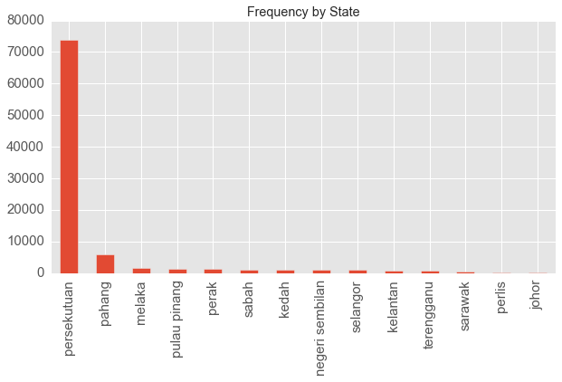
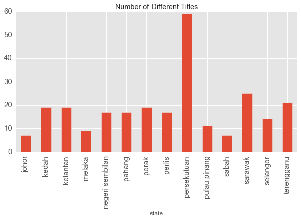
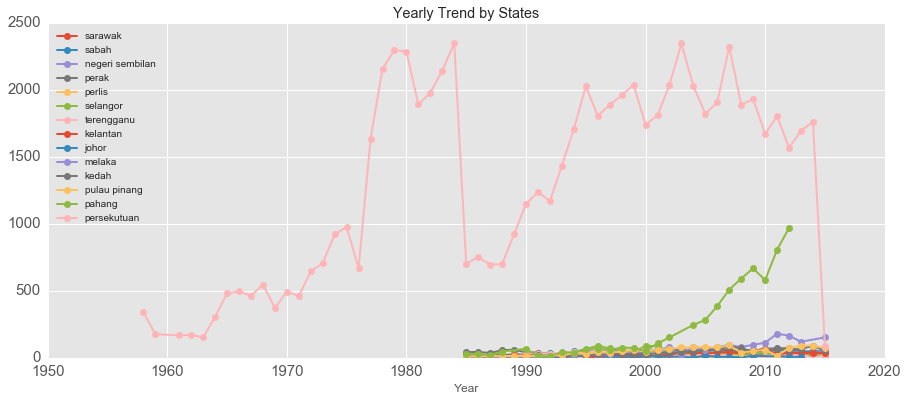
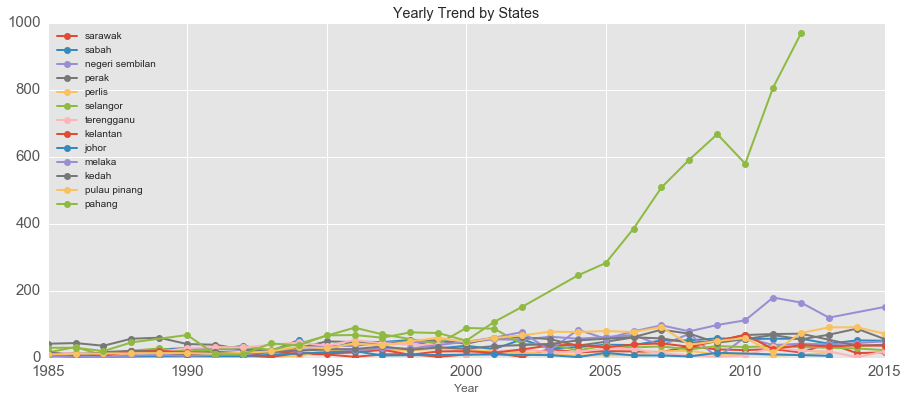
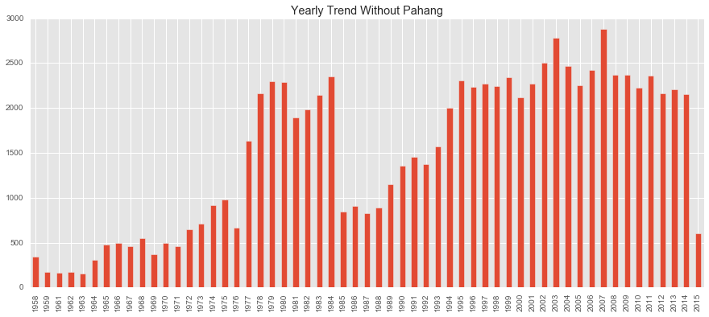
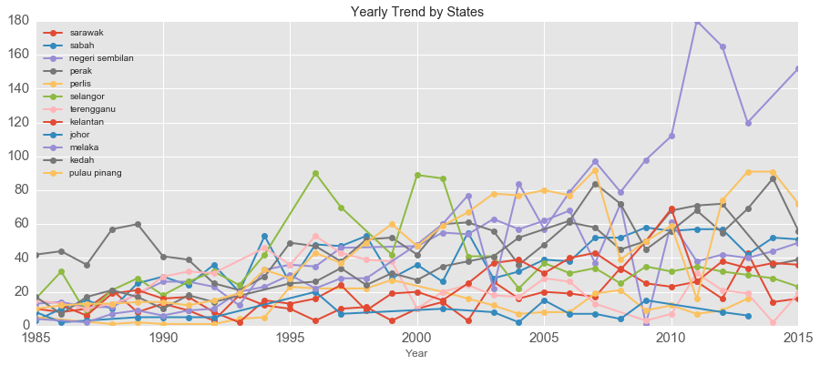

# Malaysian Honorific Title

## Dataset

An interesting [data source](https://www.reddit.com/r/malaysia/comments/4ovwdt/if_you_need_to_check_if_someone_is_a_datuk_or_not/) was pointed out by a Reddit user. The site has a complete list of names of people who are awarded with honorific titles in Malaysia from the year 1958 to 2015.

Utilizing a simple [Python script](https://github.com/amirothman/darjah_kebesaran/raw/master/get_data.py), the complete name list is extracted into a CSV file. The columns of the CSV file includes "Anugerah" (name of the title), "Bil" (identification number), "Nama" (recipient of award), "Singkatan" (acronym) and "Tahun Kurniaan" (year of award).

## Background

These honorific titles are awarded to denote appreciation, prestige and other reasons. More information about these different titles can be read in [this Wikipedia article](https://en.wikipedia.org/wiki/Malay_styles_and_titles).

There are two main categories of honorific titles. Firstly, federal titles and secondly, state titles. Federal titles are granted by the Yang di-Pertuan Agong who is the head of state of Malaysia. State titles on the other hand are granted by the Ruler or Governor of the state.

Malaysia has thirteen states. Nine of these states are headed by Malay rulers who come from the respective monarchy of the state. The other four states do not have monarchies but has a ceremonial Governor.

## Obvious Numbers

There are 267 different honorific titles. 91 194 honorific titles are granted to 86 803 different people from the year 1958 to 2015.

From the following graph we can see the yearly trend of the granting of awards.


Interesting notes:
  * A sharp increase in year 1977.
  * A strong drop in year 1985. Then the trend shows an increase beyond year 1988.
  * Another strong drop in year 2013. Then the trend shows a further decrease up to year 2015.

Now let's look at the frequency of awarding these titles. The top ten titles can be seen in the following graph.


There are some artifacts in the graph, certain titles are plotted with different bars. I theorized that this has something to do with faulty UTF-8 encoding. However, we can still analyze the data. The top three titles did not come as a surprise. All three of these titles, [Pingat Pangkuan Negara](https://ms.wikipedia.org/wiki/Pingat_Pangkuan_Negara), [Kesatria Mangku Negara](https://ms.wikipedia.org/wiki/Kesatria_Mangku_Negara) and [Ahli Mangku Negara](https://ms.wikipedia.org/wiki/Ahli_Mangku_Negara) do not have a limit in the number of people being granted. This is not the case with the other titles.

## Trend By States

In order to classify the titles by the state it is awarded, we devised a pattern matching strategy. The following Python method is able to classify all the titles except

```python

import re
def get_nama_negeri(anugerah):
    anugerah = anugerah.lower()
    nama_negeri = ["sarawak","sabah","negeri sembilan",
                   "pahang","perak","perlis",
                   "selangor","terengganu","kelantan",
                   "johor","pahang","melaka","kedah",
                   "pulau pinang","negara"]

    for negeri in nama_negeri:
        if re.search(negeri,anugerah):
            if negeri == "negara":
                return "persekutuan"
            else:
                return negeri

    anugerah_negara = ["gagah berani","perkasa persekutuan","gagah perkasa",
                       "setia mahkota","setia diraja","tentera udara",
                       "kerabat diraja","setia diraja","mahkota malaysia",
                       "perutusan keberanian"]

    for a in anugerah_negara:
        if re.search(a,anugerah):
            return "persekutuan"

    anugerah_negeri_dict = {"tuanku ja'afar yang amat terpuji":"negeri sembilan",
                            "taming sari":"perak",
                            "cura si manja kini":"perak",
                            "kinabalu":"sabah",
                            "pangkuan negeri":"pulau pinang",
                            "pangkuan negari":"pulau pinang",
                            "kenyalang":"sarawak",
                            "yam tuan raden":"negeri sembilan",
                            "salahuddin abdul aziz shah":"selangor",
                            "abdul halim mu'adzam shah":"kedah",
                            "baginda syed putra":"perlis",
                            "paduka tuanku ja'afar":"negeri sembilan",
                            "sultan ahmad shah":"pahang",
                            "sultan nazrin shah":"perak",
                            "jamalullail":"perlis",
                            "sharafuddin idris shah":"selangor",
                            "mahkota wilayah":"persekutuan",
                            "mangku wilayah":"persekutuan",
                            "tuanku mukhriz":"negeri sembilan",
                            "tuanku muhriz":"negeri sembilan",
                            "yang amat dihormati pangkat pertama":"johor",
                            "kerabat halimi":"kedah",
                            "mahawangsa":"kedah",
                            "halim muadzam shah":"kedah",

                            "darjah bakti":"persekutuan"

                          }

    for k,v in anugerah_negeri_dict.items():
        if re.search(k,anugerah):
            return v

df["nama_negeri"] = df.Anugerah.apply(lambda x: get_nama_negeri(x))

```

Now we have a new column, namely "nama_negeri". This indicates the name of the state. The label "persekutuan" would be used in the case of a federal title.

First we examine the frequency of titles by state.



We can explain this because there are much more federal titles.



We can also examine the yearly trend by different state.



By looking at the trends, apparently the data prior to 1985 consists of only federal (persekutuan) titles. In order to improve visibility, we remove the Persekutuan titles.



Something interesting to note here is that titles from Pahang is much bigger in volume than the other states. It is also worth noting that the data for titles from Pahang is only until the year 2012. This may explain why there is a drop of number of people being granted with titles in year 2012.

We plot the yearly trend again without Pahang.



Now, the decrease in granting titles in year 2012 is no longer apparent.

Lastly, we examine the yearly trend by states other than Pahang.



It seems that the other states grant titles at similar rate.
